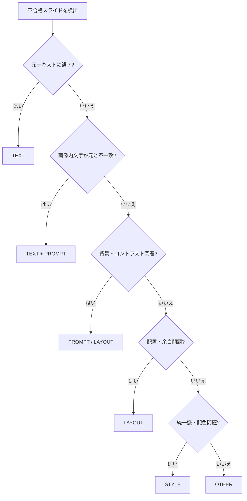

# v1.1.1「Smart Auto Fix」設計書

> **ステータス：設計中（コード未実装）**  
> 最終更新：2026-06-26

---

## 0. この設計書について

v1.1.1 Step3 として、**Smart Auto Fix（スマート自動修正）** の仕組みを設計します。

### 背景：なぜ必要か

v1.0 以降、画像レビュー不合格時は `npm run image-improve` で改善できます。  
しかし実運用では、次のような問題がありました。

| 問題 | 具体例（2026-06 実運用） |
|------|--------------------------|
| 同じ処理を繰り返しても直らない | `image-improve` を 2 回実行しても slide01 の誤字が残った |
| 原因の切り分けが人間任せ | 「元テキストの誤字」か「画像生成の文字崩れ」かを手動確認が必要 |
| 改善対象が広すぎる | プロンプトだけ直せばよいのに、文言まで変えないと直らないケースがある |
| Doctor の提案が粗い | 不合格時は常に `image-improve` を提案するだけ |

**Smart Auto Fix** は、レビュー結果から **原因（rootCause）を自動分類** し、**最適な改善処理だけ** を選んで実行する仕組みです。

---

## 1. Smart Auto Fix の目的

### 一言で言うと

> 画像レビューの「改善点」を読み、**何を直すべきか** を自動で判断し、**必要なファイルだけ** を修正して、**必要なスライドだけ** を再生成する。

### 達成したいこと

| 項目 | 現状（image-improve） | Smart Auto Fix 後（目標） |
|------|----------------------|---------------------------|
| 原因分析 | なし（レビュー全文を Gemini に渡すだけ） | rootCause を 5 分類で自動判定 |
| 修正対象 | 常に `generated-prompts/` のみ | 原因に応じて `slideXX.md` / プロンプト / 再生成を選択 |
| 再生成範囲 | failedItems 全件 | 原因スライドのみ（他スライドは触らない） |
| ループ | 人間が手動で review → improve を繰り返す | 合格または上限回数まで自動ループ（将来） |
| Doctor 連携 | `image-improve` 固定提案 | `smart-auto-fix` や段階的な提案 |

### 想定コマンド（将来）

```bash
npm run smart-auto-fix          # レビュー結果を読み、自動で最適改善を実行
npm run smart-auto-fix --dry-run # 何を直すか表示するだけ（実行しない）
```

---

## 2. 現在の image-improve との違い

### image-improve の動き（現状）

```
image_review.json（不合格スライド一覧）
    ↓
failedItems の各スライドについて：
    1. 現在の generated-prompt を読む
    2. Gemini に「レビュー改善点を反映した新プロンプト」を生成させる
    3. OpenAI Images API で画像を再生成
    4. 元画像を backup/ に保存
```

**特徴：**

- シンプルで分かりやすい
- プロンプト改善に特化している
- **原因の種類を見ていない**（テキスト問題もプロンプト問題も同じ処理）
- **`content/carousel/slideXX.md` は変更しない**
- 文言が長すぎる・誤字が画像生成由来、といったケースに弱い

### Smart Auto Fix の動き（設計）

```
image_review.json + slideXX.md + promptXX.md
    ↓
各 failedItem について rootCause を分類
    ↓
rootCause に応じた改善フローを選択
    ↓
必要なファイルだけ更新
    ↓
対象スライドだけ再生成
    ↓
（将来）image-review を自動実行 → 合格までループ
```

### 比較表

| 観点 | image-improve | Smart Auto Fix |
|------|---------------|----------------|
| 入力 | image_review.json | image_review.json + カルーセル文言 + プロンプト |
| 判断 | なし（一律プロンプト改善） | rootCause 分類 |
| 修正ファイル | `generated-prompts/promptXX.md` のみ | 原因に応じて `slideXX.md` も含む |
| 再生成 | failedItems 全部 | 対象スライドのみ |
| 向いている問題 | デザイン・配色・構図 | 誤字・可読性・レイアウト・スタイルすべて |
| 実装状態 | ✅ 実装済み | 🔜 本設計書のステップで順次実装 |

### 実運用で学んだこと（slide01 / slide03 事例）

| スライド | レビュー指摘 | 実際の原因 | image-improve の結果 | 正しい対処 |
|----------|-------------|-----------|---------------------|-----------|
| slide01 | 「お客さ が」誤字 | 元テキストは正しい。**画像生成時の文字崩れ** | 2 回実行しても 50 点台 | 文言を短く + プロンプトに EXACT text / 高コントラスト指定 |
| slide03 | 「ただの客」が背景と重なる | **プロンプト**がシルエット背景を指示していた | slide02 は直ったが slide03 が新たに不合格に | 文字背後を無地矩形に + 白文字指定 |

→ **原因によって直し方が違う** ため、Smart Auto Fix が必要。

---

## 3. rootCause の分類

レビューの `improvements`（改善点）と、元テキスト・プロンプトを突き合わせて、各スライドに **rootCause** を 1 つ（または複数）付与します。

### 分類一覧

| rootCause | 意味 | 典型例 |
|-----------|------|--------|
| **TEXT** | スライド文言そのもの、または画像内文字の崩れ・誤字 | 「お客さ が」誤字、文字数が多すぎて崩れる |
| **PROMPT** | 画像生成プロンプトの指示不足・不適切 | 背景シルエットが文字と重なる、コントラスト指定なし |
| **LAYOUT** | 文字の配置・余白・中央揃え | 「秘密」が左に寄っている、余白が狭い |
| **STYLE** | 配色・統一感・ブランドトーン | 表紙だけ他スライドと雰囲気が違う、色が硬い |
| **OTHER** | 上記に当てはまらない、その他 | API 品質のばらつき、判定の揺れ |

### 判定の考え方（ルール案）

Smart Auto Fix は、次の情報を組み合わせて rootCause を推定します。

```
入力：
  - image_review.json の slides[].improvements
  - content/carousel/slideXX.md（元テキスト）
  - images/carousel/generated-prompts/promptXX.md（プロンプト）
  - （将来）画像 OCR 結果

判定例：
  - 改善点に「誤字」「文字が欠けている」→ TEXT
  - 元テキストは正しいのに画像内だけおかしい → TEXT + PROMPT
  - 改善点に「背景と重なる」「コントラスト」→ PROMPT または LAYOUT
  - 改善点に「中央揃え」「余白」→ LAYOUT
  - 改善点に「統一感」「配色」「トーン」→ STYLE
  - どれにも当てはまらない → OTHER
```

### rootCause 判定フロー（イメージ）



### image_review.json への拡張（将来）

現状の `image_review.json` には rootCause フィールドがありません。  
Smart Auto Fix 実装時に、次のような拡張を検討します。

```json
{
  "number": 1,
  "fileName": "slide01.png",
  "score": 50,
  "rootCause": ["TEXT", "PROMPT"],
  "improvements": ["..."]
}
```

---

## 4. rootCause ごとの改善フロー

各 rootCause に対して、**触るファイル** と **実行する処理** を固定します。

### TEXT（文言・文字崩れ）

**症状：** 誤字、文字欠け、日本語が崩れる、文字数が多すぎる

| ステップ | 処理 |
|----------|------|
| 1 | `content/carousel/slideXX.md` の文言を短く・シンプルに修正 |
| 2 | `generated-prompts/promptXX.md` に EXACT text 指定を追加 |
| 3 | 白文字・大きい字号・無地背景など文字崩れ防止ルールを追記 |
| 4 | **対象スライドのみ** OpenAI で再生成 |

**触らないもの：** 他スライドの md / プロンプト / 画像

**例（slide01）：**

```
変更前: お客様が「また来たい」秘密
変更後: 「また来たい」の秘密
```

---

### PROMPT（プロンプト指示）

**症状：** 背景が文字と重なる、コントラスト不足、意図しない装飾

| ステップ | 処理 |
|----------|------|
| 1 | `slideXX.md` は原則そのまま（TEXT 問題がなければ変更しない） |
| 2 | `promptXX.md` の背景・文字色・禁止事項を具体化 |
| 3 | 「文字の背後は無地矩形」「シルエット禁止」などを明記 |
| 4 | **対象スライドのみ** 再生成 |

**例（slide03）：**

```
追加指示:
- Pure white text, NOT gray
- Solid flat navy rectangle behind text
- No human silhouettes near text area
```

---

### LAYOUT（配置・余白）

**症状：** 中央揃えでない、余白が狭い、文字が端に寄る

| ステップ | 処理 |
|----------|------|
| 1 | `slideXX.md` の改行・行数を調整（必要なら 2 行に分割） |
| 2 | プロンプトに center alignment / 20% safe zone / wide margins を追記 |
| 3 | **対象スライドのみ** 再生成 |

**TEXT との違い：** 文言の意味は変えず、**見せ方** を直す。

---

### STYLE（統一感・配色）

**症状：** 表紙だけ雰囲気が違う、色が硬い、シリーズ感がない

| ステップ | 処理 |
|----------|------|
| 1 | 合格スライド（例：slide02）のプロンプトから配色・パターンを参照 |
| 2 | 対象スライドのプロンプトに「他スライドと統一」を追記 |
| 3 | **対象スライドのみ** 再生成 |
| 4 | 点数が 80 以上なら合格として続行（STYLE は致命的でないことが多い） |

**注意：** STYLE だけの不合格は、公開可能な場合もある（後述の品質基準参照）。

---

### OTHER（その他）

**症状：** 上記に分類できない、API のランダム性

| ステップ | 処理 |
|----------|------|
| 1 | 現行の `image-improve` と同様、Gemini でプロンプト改善 |
| 2 | 再生成（最大 1 回） |
| 3 | 改善しなければ人間確認フラグを立てる |

---

### 改善フロー全体図

```
image_review.json（passed: false）
    ↓
failedItems を 1 件ずつ処理
    ↓
rootCause を判定
    ↓
┌─────────┬─────────┬─────────┬─────────┬─────────┐
│  TEXT   │ PROMPT  │ LAYOUT  │  STYLE  │  OTHER  │
└────┬────┴────┬────┴────┬────┴────┬────┴────┬────┘
     │         │         │         │         │
 slide.md   prompt.md  prompt.md  prompt.md  Gemini
  短縮       具体化     配置指定    統一指定    改善
     │         │         │         │         │
     └─────────┴─────────┴─────────┴─────────┘
                         ↓
              対象スライドのみ再生成
                         ↓
              image-review（将来は自動）
                         ↓
              passed: true または上限到達
```

---

## 5. Doctor との連携

### 現状の Doctor

Doctor（`npm run doctor`）は、画像レビュー不合格時に **常に** 次を提案します。

```
→ npm run image-improve
```

### Smart Auto Fix 導入後の Doctor（設計）

Doctor は `image_review.json` を読み、**rootCause の概要** と **最適コマンド** を表示します。

| 状態 | Doctor の表示（案） |
|------|---------------------|
| passed: false + TEXT 疑い | `npm run smart-auto-fix`（文言とプロンプトを自動修正） |
| passed: false + PROMPT のみ | `npm run smart-auto-fix`（プロンプトのみ修正） |
| passed: false + STYLE のみ（80 点以上） | `公開可能。統一感改善は任意 → smart-auto-fix` |
| passed: true + score 80〜89 | `合格。公開可能。さらに磨くなら smart-auto-fix` |
| passed: true + score 90 以上 | `公開推奨。npm run export-instagram` |

### Doctor 表示イメージ（将来）

```
❌ 要対応 画像レビュー（slide01, slide03）
   passed: false / score: 79
   原因: slide01=TEXT, slide03=PROMPT

【次に実行すべきおすすめコマンド】
→ npm run smart-auto-fix
   原因に応じて文言・プロンプトを自動修正し、対象スライドのみ再生成します。
```

### 3 ツールの役割分担

| ツール | 役割 | いつ使う |
|--------|------|----------|
| **health-check** | 環境（.env、フォルダ）の確認 | 初回セットアップ時 |
| **doctor** | 全体状態の診断 + 次のコマンド提案 | 日常の確認・迷ったとき |
| **smart-auto-fix** | 画像問題の自動修正実行 | レビュー不合格時 |

```
health-check  … 「道具は揃っているか？」
doctor        … 「今どこまで進んでいるか？次は何？」
smart-auto-fix … 「画像の問題を自動で直す」
```

---

## 6. Nano Banana 導入後の役割分担（v1.2 以降）

v1.2 では **Nano Banana** を使った画像改善が予定されています（`docs/VERSION.md` 参照）。  
Smart Auto Fix と Nano Banana は **競合ではなく分担** します。

### 役割分担（設計案）

| 処理 | 担当 | 説明 |
|------|------|------|
| 原因分類（rootCause） | **Smart Auto Fix** | レビュー結果から TEXT / PROMPT 等を判定 |
| 文言・プロンプト修正 | **Smart Auto Fix** | `slideXX.md` / `promptXX.md` を更新 |
| 軽微な画像修正（色・コントラスト・トリミング） | **Nano Banana** | 既存画像をベースに部分修正 |
| 全面再生成（文字崩れ・構図変更） | **OpenAI Images API** | プロンプト更新後に再生成 |
| ループ制御・合格判定 | **Smart Auto Fix** | review → fix → review の繰り返し |

### フロー（v1.2 完成イメージ）

```
image-review（不合格）
    ↓
Smart Auto Fix: rootCause 判定
    ↓
┌──────────────────────────────────────┐
│ TEXT / LAYOUT     → 文言+プロンプト修正 → OpenAI 再生成 │
│ PROMPT（軽度）    → プロンプト修正 → Nano Banana 部分修正 │
│ PROMPT（重度）    → プロンプト修正 → OpenAI 再生成      │
│ STYLE             → プロンプト統一 → Nano Banana or OpenAI │
│ OTHER             → image-improve 相当の Gemini 改善     │
└──────────────────────────────────────┘
    ↓
image-review（再採点）
    ↓
合格 or 人間確認
```

### 使い分けの目安

| 状況 | Nano Banana | OpenAI 再生成 |
|------|-------------|---------------|
| 文字は正しいが色・コントラストだけ弱い | ✅ 向いている | 不要 |
| 日本語が崩れている・誤字 | ❌ 向いていない | ✅ 文言短縮 + 再生成 |
| 背景パターンが文字と重なる | △ 部分修正可能 | ✅ プロンプト修正 + 再生成が確実 |
| 表紙だけ統一感がない | ✅ 向いている | △ 場合による |

---

## 7. 品質基準

Smart Auto Fix は、単なる「合格 / 不合格」だけでなく、**公開の推奨度** も表示します。

### スコアと意味

| 点数 | 判定 | 意味 | 推奨アクション |
|------|------|------|----------------|
| **90〜100** | 公開推奨 | そのまま Instagram に投稿してよい品質 | `export-instagram` → 投稿 |
| **80〜89** | 合格 | 基準を満たしている。公開可能 | そのまま公開 OK。磨きたければ smart-auto-fix |
| **79 以下** | 要改善 | 1 枚以上 80 点未満、または passed: false | smart-auto-fix を実行 |

### 現行システムとの関係

| 項目 | 現状 | Smart Auto Fix 後 |
|------|------|-------------------|
| 合格ライン | 各スライド **80 点以上** | 変更なし |
| passed | 1 枚でも 80 未満 → false | 変更なし |
| 公開推奨 | 表示なし | **90 点以上** で「公開推奨」ラベル |
| Doctor 提案 | 不合格 → image-improve | スコア帯に応じた提案 |

### スコア帯ごとの Doctor メッセージ（案）

```
90 点以上  → 「公開推奨です。output/instagram/ を使って投稿できます。」
80〜89 点  → 「合格です。公開可能です。」
79 点以下  → 「要改善です。npm run smart-auto-fix を実行してください。」
```

---

## 8. 今後の実装ステップ

コード変更は **この設計書承認後** に段階的に行います。

### Step 1：rootCause 判定モジュール（v1.1.1）

| 項目 | 内容 |
|------|------|
| 新規ファイル | `src/lib/root_cause.js` |
| 入力 | improvements テキスト + slide.md + prompt.md |
| 出力 | `TEXT` / `PROMPT` / `LAYOUT` / `STYLE` / `OTHER` |
| コマンド | なし（ライブラリのみ） |
| テスト | slide01 / slide03 事例で判定精度を確認 |

### Step 2：Smart Auto Fix 本体（v1.1.1）

| 項目 | 内容 |
|------|------|
| 新規ファイル | `src/smart_auto_fix.js` |
| 処理 | rootCause 判定 → ファイル修正 → 対象スライドのみ再生成 |
| コマンド | `npm run smart-auto-fix` |
| オプション | `--dry-run`（実行せず計画だけ表示） |
| 安全策 | 変更前に backup/ へ保存 |

### Step 3：Doctor 連携（v1.1.1）✅

| 項目 | 内容 |
|------|------|
| 変更ファイル | `src/doctor.js` |
| 内容 | rootCause 概要表示、`smart-auto-fix` 提案、スコア帯メッセージ |

### Step 3-4：apply 実装（v1.1.1）✅

| 項目 | 内容 |
|------|------|
| 変更ファイル | `src/smart_auto_fix.js` |
| 内容 | `--apply` で Markdown 末尾に Smart Auto Fix 指示を追記 |
| 安全策 | 変更前に `images/carousel/backup/` へバックアップ |

### Step 3-5：Smart Auto Fix Report（v1.1.1）✅

| 項目 | 内容 |
|------|------|
| 保存先 | `reports/smart-auto-fix/YYYY-MM-DD-HHmmss.md` |
| 作成タイミング | dry-run / apply どちらでも毎回 |
| 内容 | 実行概要・改善対象・rootCause・変更ファイル・結果 |

#### Report に含まれる項目

```
- 実行日時 / 実行モード（dry-run / apply）
- 画像レビュー総合 score / passed / failedItems
- 改善対象スライド（score / rootCause / reason / matchedKeywords）
- 修正予定ファイル / 改善方針
- 実際に変更したファイル / バックアップしたファイル
- 結果（改善対象なし / dry-run完了 / apply完了 / 手動確認が必要）
```

#### 結果ラベルの意味

| 結果 | 意味 |
|------|------|
| 改善対象なし | すべて合格ライン以上 |
| dry-run完了 | 改善計画を表示した（ファイル未変更） |
| apply完了 | Smart Auto Fix 指示を追記した |
| 手動確認が必要 | rootCause が OTHER のスライドがある |

**Git 管理：** `reports/` は `.gitignore` で除外（ローカル実行ログとして保存）

### Step 4：自動ループ（v1.1.2 または v1.2）

| 項目 | 内容 |
|------|------|
| 処理 | smart-auto-fix → image-review を最大 N 回繰り返し |
| 上限 | 例：3 回（API クォータ保護） |
| 停止条件 | passed: true、または人間確認フラグ |

### Step 5：Nano Banana 連携（v1.2）

| 項目 | 内容 |
|------|------|
| 新規 | Nano Banana API ラッパー |
| 連携 | rootCause が STYLE / 軽度 PROMPT のとき Nano Banana を選択 |
| 設計書 | `docs/NanoBanana連携設計.md`（別途） |

### Step 6：daily パイプライン統合（v1.2）

| 項目 | 内容 |
|------|------|
| 変更 | `scripts/run_daily.sh` |
| 内容 | 画像レビュー不合格時、image-improve の代わりに smart-auto-fix を呼ぶ |

### 実装優先度

```
高 ─ rootCause 判定 + smart-auto-fix 本体 + Doctor 連携
中 ─ 自動ループ + dry-run
低 ─ Nano Banana 連携 + daily 統合
```

---

## 9. 用語集（PC 初心者向け）

| 用語 | 意味 |
|------|------|
| rootCause | 「根本原因」。レビュー指摘の背景にある、本当の問題の種類 |
| Smart Auto Fix | 原因を見て、最適な直し方を自動で選ぶ仕組み |
| image-improve | 現行の画像改善コマンド。プロンプトを Gemini で書き換えて再生成 |
| failedItems | 80 点未満だったスライドの一覧（例：`slide01`, `slide03`） |
| EXACT text | プロンプト内で「この文字を正確に表示せよ」と指定すること |
| dry-run | 実際には実行せず、何をするかだけ表示するお試しモード |

---

## 10. 関連ドキュメント

| ファイル | 内容 |
|----------|------|
| [README.md](../README.md) | 使い方・コマンド一覧 |
| [VERSION.md](./VERSION.md) | バージョン計画（v1.2 Nano Banana） |
| [Genspark連携設計.md](./Genspark連携設計.md) | v1.1 リサーチ連携 |
| [CHANGELOG.md](./CHANGELOG.md) | 変更履歴 |

---

*本設計書は v1.1.1 Step3 の成果物です。実装開始前の設計段階であり、コード変更は含みません。*
