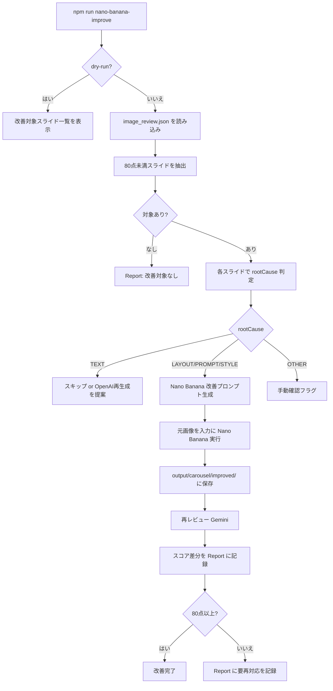

# v1.2「Nano Banana 画像改善」設計書

> **ステータス：設計中（コード未実装）**  
> 最終更新：2026-06-26  
> **本書は設計フェーズの成果物です。実装は行いません。**

---

## 0. この設計書について

v1.2 では、OpenAI Images API で生成済みのカルーセル画像を、**Nano Banana** を使ってレビュー結果に基づき改善し、Instagram 公開前の画像品質を引き上げます。

v1.1.1 で整備した **Health Check / Doctor / Smart Auto Fix / rootCause / Report** の思想を維持しつつ、**画像そのものを安全に改善する専用レイヤー** を追加します。

### 設計思想（必須方針）

| 方針 | 内容 |
|------|------|
| 品質基準の維持 | **80 点以上＝合格**、**90 点以上＝公開推奨**（v1.1.1 から変更なし） |
| 改善対象の限定 | **80 点未満のスライドのみ** を Nano Banana 改善対象とする |
| 元画像の保護 | `images/carousel/output/` の元画像は **上書きしない** |
| 改善画像の保存先 | `output/carousel/improved/` に保存 |
| スコア差分の可視化 | 改善前後の点数差分を **Report** に記録 |
| 既存工程の非破壊 | OpenAI Images 生成・`npm run daily` パイプラインは **壊さない** |
| v1.1.1 思想の継承 | dry-run 標準、Doctor 連携、rootCause 連携、reports は Git 管理外 |

---

## 1. v1.2 の目的

### 一言で言うと

> OpenAI で作ったカルーセル画像のうち **80 点未満だけ** を Nano Banana で改善し、**元画像を残したまま** 公開品質（90 点以上）に近づける。

### 達成したいこと

| 項目 | v1.1.1 まで | v1.2 後（目標） |
|------|------------|----------------|
| 画像改善手段 | OpenAI 全面再生成（`image-improve`）が中心 | Nano Banana による **既存画像ベースの部分改善** を追加 |
| 改善計画 | Smart Auto Fix（文言・プロンプト指示追記） | 計画に加え、**画像ファイル自体** を改善 |
| 元画像 | backup/ に退避後、output/ を上書きすることがある | output/ は維持、改善版は別フォルダ |
| 効果測定 | レビュー点数のみ | **改善前後スコア差分** を Report で記録 |
| 原因別改善 | rootCause で TEXT→OpenAI 再生成を推奨 | STYLE / LAYOUT 等は **Nano Banana 優先** |

### v1.2 で解決したい課題

| 課題 | 例 |
|------|-----|
| 全面再生成コストが高い | 配色・コントラストだけ直したいのに OpenAI で 5 枚作り直す |
| 元画像との比較が難しい | 上書き後、改善前の状態を確認しにくい |
| 80〜89 点の「合格だが公開推奨ではない」画像 | 90 点以上まで Nano Banana で磨きたい |
| Smart Auto Fix と画像改善の分離 | 指示追記（apply）と実際の画像改善が別工程 |

---

## 2. 対象範囲

v1.2 で **対象とする** もの：

| 対象 | 説明 |
|------|------|
| カルーセル画像 5 枚 | `images/carousel/output/slide01.png` 〜 `slide05.png` |
| 画像レビュー結果 | `images/carousel/review/image_review.json` / `image_review.md` |
| 80 点未満スライド | `failedItems` または各スライド `score < 80` |
| 80〜89 点スライド（任意モード） | `--boost` 等で 90 点公開推奨を目指す改善（将来オプション） |
| rootCause 連携 | Smart Auto Fix の TEXT / LAYOUT / PROMPT / STYLE / OTHER と連携 |
| 改善後再レビュー | Gemini による改善画像の再採点 |
| レポート | `reports/nano-banana-improve/` への Markdown 保存 |
| Doctor / Smart Auto Fix 連携 | 不合格時の次コマンド提案に Nano Banana を組み込む |

---

## 3. 非対象範囲

v1.2 で **対象外** とするもの（意図的にやらないこと）：

| 非対象 | 理由 |
|--------|------|
| OpenAI Images 初回生成の置き換え | 既存 `generate-image` / `openai-image` はそのまま維持 |
| カルーセル文言（テキスト）の AI 生成 | v1.0 の `create_carousel.js` 等は変更しない |
| Genspark リサーチ連携 | v1.1 の範囲。v1.2 では触らない |
| Instagram 自動投稿 | 引き続き `output/instagram/` を人間が使う |
| 元画像の上書き | `images/carousel/output/` は読み取り専用として扱う |
| 合格スライド（80 点以上）の一括改善 | デフォルトでは改善しない（コスト・品質リスク抑制） |
| TEXT 起因の誤字・文字崩れの Nano Banana 単独修正 | rootCause=TEXT は **OpenAI 再生成 + Smart Auto Fix** を優先（Nano Banana 非推奨） |
| `npm run daily` パイプラインの全面組み込み | v1.2 初期は **独立コマンド** として提供。daily 統合は v1.2 後半または v1.3 |
| Nano Banana API の自動プロビジョニング | API キー設定は `.env` で人間が行う |

---

## 4. 全体フロー

### 4.1 標準フロー（1 スライド改善の流れ）



### 4.2 v1.1.1 ツールとの位置づけ

```
npm run daily
  → OpenAI 画像生成 → image-review

【不合格・要改善時】
npm run doctor                    … 状態診断
npm run smart-auto-fix            … 文言・プロンプト改善計画（dry-run）
npm run smart-auto-fix -- --apply … 指示追記
npm run nano-banana-improve       … 画像改善（v1.2 新規・dry-run 標準）
npm run nano-banana-improve -- --apply … 実際に Nano Banana 改善

【確認】
npm run image-review              … 改善後の再採点（または専用 review-improved）
reports/nano-banana-improve/*.md  … スコア差分レポート
```

### 4.3 rootCause と改善手段の分担（v1.2）

| rootCause | 第一選択 | 第二選択 |
|-----------|----------|----------|
| **TEXT** | Smart Auto Fix + OpenAI 再生成 | Nano Banana は **使わない** |
| **LAYOUT** | Nano Banana（コントラスト・余白・背景整理） | OpenAI 再生成 |
| **PROMPT** | Smart Auto Fix apply → Nano Banana | OpenAI 再生成 |
| **STYLE** | Nano Banana（配色・統一感） | Smart Auto Fix apply |
| **OTHER** | 手動確認 | Nano Banana は人間判断後 |

---

## 5. ディレクトリ構成

v1.2 で追加・利用するディレクトリ（既存は変更しない）：

```
AI-SNS-Automation/
├── images/
│   └── carousel/
│       ├── output/              … 【既存・読取専用】OpenAI 生成元画像
│       │   ├── slide01.png
│       │   └── ...
│       ├── generated-prompts/   … 【既存】画像生成プロンプト
│       ├── review/              … 【既存】image_review.json / .md
│       └── backup/              … 【既存】各種バックアップ
│
├── output/
│   └── carousel/
│       └── improved/            … 【v1.2 新規】Nano Banana 改善画像
│           ├── slide01.png      … 改善版（対象スライドのみ存在）
│           ├── slide03.png
│           └── manifest.json    … 改善メタ情報（任意）
│
├── reports/
│   └── nano-banana-improve/     … 【v1.2 新規】改善レポート（Git 管理外）
│       └── YYYY-MM-DD-HHmmss.md
│
└── src/
    ├── improve_with_nano_banana.js   … 【v1.2 新規】改善本体
    ├── review_improved_images.js     … 【v1.2 新規・任意】改善画像専用レビュー
    └── lib/
        └── nano_banana.js            … 【v1.2 新規】API ラッパー
```

### パス設計の意図

| パス | 意図 |
|------|------|
| `images/carousel/output/` | OpenAI 生成の **正本**。v1.2 でも上書きしない |
| `output/carousel/improved/` | Instagram 公開候補の **改善版**。export 時に参照可能 |
| `reports/nano-banana-improve/` | Smart Auto Fix Report と同様、実行ログとしてローカル保存 |

---

## 6. 新規作成予定ファイル

| ファイル | 役割 | 優先度 |
|----------|------|--------|
| `src/improve_with_nano_banana.js` | 改善本体（dry-run / apply、Report 生成） | 高 |
| `src/lib/nano_banana.js` | Nano Banana API 呼び出し・リトライ・エラー整形 | 高 |
| `src/review_improved_images.js` | 改善画像のみ再レビュー（または既存 review の拡張） | 中 |
| `docs/V1.2_NANO_BANANA_IMAGE_IMPROVEMENT_DESIGN.md` | 本設計書 | — |
| `prompts/nano-banana/improve_template.md` | 改善プロンプトのテンプレート | 中 |

### 更新予定ファイル（v1.2 後半）

| ファイル | 変更内容 |
|----------|----------|
| `src/doctor.js` | Nano Banana 改善状態・Report パスを診断に追加 |
| `src/smart_auto_fix.js` | rootCause に応じ Nano Banana / OpenAI を提案 |
| `src/export_instagram_package.js` | improved/ があればスライド参照を切り替え（任意） |
| `package.json` | `nano-banana-improve` 等の scripts 追加 |
| `.env.example` | `NANO_BANANA_API_KEY` 等 |
| `README.md` | v1.2 コマンド説明 |

---

## 7. 入力ファイル

| ファイル | 必須 | 用途 |
|----------|------|------|
| `images/carousel/review/image_review.json` | ✅ | 改善対象判定・各スライド score / improvements |
| `images/carousel/review/image_review.md` | △ | 人間向け参考・OTHER 時の手動確認 |
| `images/carousel/output/slideXX.png` | ✅ | Nano Banana 入力元画像 |
| `images/carousel/generated-prompts/promptXX.md` | △ | 改善プロンプト生成の参考 |
| `content/carousel/slideXX.md` | △ | 画像内テキストの正しい文言参照 |
| `src/lib/root_cause.js`（既存） | ✅ | rootCause 判定 |
| `.env`（API キー） | apply 時必須 | Nano Banana / Gemini 認証 |

---

## 8. 出力ファイル

| ファイル | 説明 |
|----------|------|
| `output/carousel/improved/slideXX.png` | Nano Banana 改善後画像（対象スライドのみ） |
| `output/carousel/improved/manifest.json` | 改善日時・元画像パス・rootCause・API メタ情報 |
| `images/carousel/review/image_review.improved.json` | 改善画像再レビュー結果（任意・既存と分離） |
| `reports/nano-banana-improve/YYYY-MM-DD-HHmmss.md` | 改善レポート（スコア差分含む） |

### manifest.json（案）

```json
{
  "improvedAt": "2026-06-26T12:00:00.000Z",
  "sourceDir": "images/carousel/output",
  "improvedSlides": [
    {
      "slideKey": "slide03",
      "rootCause": "LAYOUT",
      "sourceScore": 75,
      "improvedScore": 88,
      "scoreDelta": 13
    }
  ]
}
```

---

## 9. 改善対象判定ルール

### 9.1 基本ルール

| 条件 | 改善対象 |
|------|----------|
| `slide.score < 80` | ✅ 対象 |
| `failedItems` に含まれる | ✅ 対象（score 未満と重複可） |
| `slide.score >= 80` かつ `failedItems` にない | ❌ 対象外 |
| `passed: true` かつ全スライド 80 以上 | ❌ 改善対象なし |

### 9.2 rootCause による実行可否

| rootCause | Nano Banana 実行 | 備考 |
|-----------|-------------------|------|
| TEXT | ❌ デフォルトスキップ | 誤字・文字崩れは OpenAI 再生成を Doctor が提案 |
| LAYOUT | ✅ 実行 | コントラスト・背景・余白 |
| PROMPT | ✅ 実行 | Smart Auto Fix apply 後が望ましい |
| STYLE | ✅ 実行 | 配色・統一感 |
| OTHER | ⚠ 手動確認 | Report に「手動確認が必要」 |

### 9.3 オプション（将来）

| オプション | 動作 |
|------------|------|
| `--boost` | 80〜89 点スライドも 90 点公開推奨を目指して改善 |
| `--slide=03` | 指定スライドのみ改善 |
| `--max=N` | 1 回の実行で最大 N 枚まで（API コスト制限） |

---

## 10. Nano Banana 改善プロンプト方針

### 10.1 基本方針

- **元画像を入力** とし、レビューの `improvements` を具体的指示に変換する
- **画像内日本語テキストは変更しない**（TEXT 問題は Nano Banana 対象外）
- **1 枚 1 リクエスト**。5 枚一括ではなくスライド単位
- プロンプトは **英語** を基本とし、テキスト内容は `slideXX.md` から EXACT 引用

### 10.2 rootCause 別プロンプト重点

| rootCause | プロンプトで強調する指示 |
|-----------|-------------------------|
| LAYOUT | 文字エリア背景を無地化、コントラスト強化、余白 20%、中央配置 |
| PROMPT | 文字サイズ拡大、safe margin、no extra text、EXACT text 維持 |
| STYLE | 他スライドと統一した配色・フォントトーン、シリーズ感 |

### 10.3 プロンプト生成フロー

```
image_review.json（該当スライド improvements）
    +
content/carousel/slideXX.md（正しい文言）
    +
rootCause（Smart Auto Fix 共通）
    ↓
Gemini またはテンプレートで Nano Banana 用短い英語指示を生成
    ↓
Nano Banana API に { 元画像 + 指示 } を送信
```

### 10.4 禁止事項（プロンプトに含める）

- 新しい日本語テキストの追加
- スライド文言の意訳・変更
- 5 枚を 1 枚に統合
- 元画像の解像度・1:1 比率の変更

---

## 11. 再レビュー方針

### 11.1 目的

改善画像が **実際に 80 点以上になったか** を Gemini で確認し、スコア差分を Report に記録する。

### 11.2 再レビュー対象

| 画像 | レビュー元 |
|------|-----------|
| 改善済みスライド | `output/carousel/improved/slideXX.png` |
| 未改善スライド | 既存 `image_review.json` のスコアを **そのまま引用** |

### 11.3 再レビュー実行タイミング

| モード | 再レビュー |
|--------|-----------|
| dry-run | 実行しない（計画のみ） |
| apply | 改善成功スライドのみ自動実行（推奨） |

### 11.4 出力

- `images/carousel/review/image_review.improved.json`（既存 `image_review.json` は上書きしない）
- Report に **before / after / delta** を表形式で記載

### 11.5 採点基準（v1.1.1 維持）

| 点数 | 判定 |
|------|------|
| 90〜100 | 公開推奨 |
| 80〜89 | 合格 |
| 79 以下 | 要改善（再対応または OpenAI 再生成を提案） |

---

## 12. レポート仕様

Smart Auto Fix Report（v1.1.1）と同様の思想で、**毎回 Markdown を保存** します。

### 12.1 保存先

```
reports/nano-banana-improve/YYYY-MM-DD-HHmmss.md
```

- dry-run / apply **どちらでも作成**
- 改善対象なしでも作成
- `reports/` は `.gitignore` で除外（v1.1.1 継承）

### 12.2 レポートに含める項目

| セクション | 内容 |
|------------|------|
| 実行概要 | 実行日時、モード（dry-run / apply）、image_review 総合 score / passed |
| 改善対象 | スライド名、改善前 score、rootCause、matchedKeywords |
| 改善プロンプト | 各スライドに送った指示（apply 時） |
| スコア差分 | before → after → delta（apply + 再レビュー後） |
| 出力ファイル | `output/carousel/improved/` に保存したファイル一覧 |
| スキップ | TEXT / OTHER / 80 点以上でスキップした理由 |
| 結果 | 改善対象なし / dry-run 完了 / apply 完了 / 手動確認が必要 / 一部失敗 |

### 12.3 スコア差分表（例）

```markdown
| スライド | 改善前 | 改善後 | 差分 | 判定 |
|----------|--------|--------|------|------|
| slide03  | 75     | 88     | +13  | 合格 |
| slide01  | 50     | —      | —    | TEXT のためスキップ |
```

### 12.4 実行後のコンソール表示

```
【レポート保存】
→ reports/nano-banana-improve/2026-06-26-143022.md
   結果: apply完了
```

---

## 13. エラー時の扱い

v1.1.1 と同様、**確認用コマンドは可能な限り最後まで実行** し、レポートにエラーを記録します。

### 13.1 エラー種別と対応

| エラー | 対応 | daily への影響 |
|--------|------|----------------|
| `image_review.json` なし | エラーメッセージ + Report に記録、exit code 1 | なし（独立コマンド） |
| Nano Banana API キー未設定 | apply 時のみエラー。dry-run は続行 | なし |
| Nano Banana API 429 / 5xx | リトライ（最大 3 回）→ 失敗スライドを Report に記載、**他スライドは続行** | なし |
| 元画像なし | 該当スライドをスキップ、Report に記載 | なし |
| 再レビュー（Gemini）失敗 | 改善画像は保存済み、再レビューのみ「未実施」と Report | なし |
| TEXT rootCause | スキップ（エラーではない）、Doctor に OpenAI 再生成を提案 | なし |

### 13.2 exit code 方針

| コマンド | 方針 |
|----------|------|
| dry-run | 原則 **0**（Smart Auto Fix と同様） |
| apply | 全スライド失敗時のみ **1**、部分成功は **0** + Report に失敗明記 |

### 13.3 ロールバック

- 元画像は `images/carousel/output/` に残るため **ロールバック不要**
- 改善版を使わない場合は `output/carousel/improved/` を削除または無視
- export 時は improved がなければ従来どおり output/ の画像を使用

---

## 14. 完成判定基準

v1.2 を **完了** とみなす条件：

### 14.1 機能要件

| # | 要件 | 完了条件 |
|---|------|----------|
| 1 | 改善対象判定 | 80 点未満スライドのみを正しく抽出できる |
| 2 | dry-run | ファイル変更・API 呼び出しなしで計画と Report を出力 |
| 3 | apply | Nano Banana で改善画像を `output/carousel/improved/` に保存 |
| 4 | 元画像非破壊 | `images/carousel/output/` が apply 後も unchanged |
| 5 | 再レビュー | 改善後スコアを取得し、差分を Report に記載 |
| 6 | rootCause 連携 | TEXT はスキップ、LAYOUT / STYLE は Nano Banana 実行 |
| 7 | Doctor 連携 | 不合格時に `nano-banana-improve` を適切に提案 |
| 8 | Report | dry-run / apply / 改善対象なし、すべてで Report 作成 |

### 14.2 品質要件

| 項目 | 基準 |
|------|------|
| 合格ライン | 各スライド **80 点以上**（変更なし） |
| 公開推奨 | **90 点以上**（変更なし） |
| 改善成功率 | テストセットで LAYOUT / STYLE 対象の **50% 以上** が 80 点以上に到達（目標） |
| 既存パイプライン | `npm run daily` が v1.2 変更前と同様に動作 |

### 14.3 ドキュメント要件

| ドキュメント | 内容 |
|--------------|------|
| 本設計書 | 実装完了後にステータスを「実装済み」に更新 |
| README.md | コマンド・Report・dry-run / apply の説明 |
| CHANGELOG.md / VERSION.md | v1.2 リリース記録 |

### 14.4 想定コマンド（v1.2 完成時）

```bash
npm run nano-banana-improve              # dry-run + Report
npm run nano-banana-improve -- --apply   # 改善実行 + 再レビュー + Report
npm run doctor                           # Nano Banana 状態を含む診断
```

---

## 15. 実装ステップ（参考・本フェーズでは未着手）

| Step | 内容 |
|------|------|
| 1 | `src/lib/nano_banana.js` API ラッパー |
| 2 | `src/improve_with_nano_banana.js` dry-run + Report |
| 3 | apply モード + `output/carousel/improved/` 保存 |
| 4 | 再レビュー + スコア差分 |
| 5 | Doctor / Smart Auto Fix 連携 |
| 6 | export-instagram への improved 参照（任意） |
| 7 | daily パイプライン統合（v1.2 後半） |

---

## 16. 関連ドキュメント

| ファイル | 内容 |
|----------|------|
| [VERSION.md](./VERSION.md) | バージョン計画 |
| [CHANGELOG.md](./CHANGELOG.md) | 変更履歴 |
| [SmartAutoFix設計.md](./SmartAutoFix設計.md) | rootCause・Nano Banana 分担（v1.1.1） |
| [README.md](../README.md) | 運用コマンド一覧 |

---

*本設計書は v1.2 設計フェーズの成果物です。実装は別ステップで行います。*
