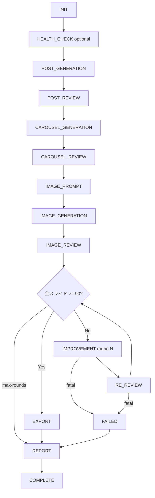

# v1.3「完全自動品質パイプライン」設計書

> **ステータス：MVP 完了（Phase 8 ドキュメント反映）**  
> 最終更新：2026-06-27  
> 本書は設計書兼実装状況メモです。Phase 1〜8 はコード・ドキュメント反映済み。

---

## 0. この設計書について

v1.3 では、投稿生成からレビュー・画像改善・再レビューを経て、**全スライド 90 点以上（公開推奨）** になるまで自動改善を繰り返し、**Instagram Package** を完成させる **上位品質パイプライン** を構築します。

v1.1.1（Health Check / Doctor / Smart Auto Fix）、v1.2（Nano Banana 画像改善）、v1.2.1（manifest / report schema 固定、CLI 終了コード統一）の思想を **すべて継承** します。

### 設計思想（必須方針）

| 方針 | 内容 |
|------|------|
| 品質基準 | **80 点以上＝合格**、**90 点以上＝公開推奨** |
| ループ終了条件 | 全スライド `>= targetScore(90)` で EXPORT フェーズへ |
| dry-run 標準 | デフォルトは API 未呼び出し・planned のみ（`--apply` で本番） |
| 運用品質重視 | health-check / doctor 連携、レポート・metrics 必須 |
| schema 固定 | manifest（MANIFEST_SCHEMA）、report（REPORT_SCHEMA）を維持 |
| 終了コード統一 | `exit_codes.js` を拡張しパイプライン全体で集約 |
| 非破壊 | `run_daily.sh` / `npm run daily` は **変更・削除しない** |
| 元画像保護 | `images/carousel/output/` は上書きしない |
| TEXT rootCause | Smart Auto Fix + OpenAI 再生成（Nano Banana 非推奨） |
| reports 非 Git | `reports/` は `.gitignore` で除外 |

### v1.3 と run_daily の関係

| 項目 | `npm run daily` | v1.3 quality pipeline |
|------|-----------------|------------------------|
| 位置づけ | v1.0〜v1.1 の **従来一括実行** | **品質ループ付き上位パイプライン** |
| 画像改善 | `image-improve`（OpenAI 再生成）中心 | rootCause 別（SAF / Nano Banana / OpenAI） |
| 合格条件 | 80 点で export ゲート | **90 点まで自動ループ** |
| 共存 | **維持** | 追加（置き換えではない） |

---

## 1. 修正版アーキテクチャ

### 1.1 レイヤ構成

```
┌─────────────────────────────────────────────────────────────┐
│  scripts/run_quality_pipeline.js   … 薄い CLI 入口          │
│    parseArgs / process.exit / ログプレフィックス              │
└───────────────────────────┬─────────────────────────────────┘
                            │ import
┌───────────────────────────▼─────────────────────────────────┐
│  src/lib/quality_pipeline.js   … オーケストレーション本体     │
│    runPipeline(config, hooks, metrics)                        │
│    phase 遷移 / round ループ / state 永続化 / exit code 集約  │
└───┬─────────┬─────────┬─────────┬─────────┬─────────────────┘
    │         │         │         │         │
    ▼         ▼         ▼         ▼         ▼
 phases   config    retry    metrics    hooks
    │         │         │         │         │
    └─────────┴─────────┴─────────┴─────────┘
                            │
        ┌───────────────────┼───────────────────┐
        ▼                   ▼                   ▼
  既存 src/*.js        既存 lib 直呼び      暫定 subprocess
  (generate_post 等)   (nano_banana 等)    (未 lib 化 CLI のみ)
        │                   │                   │
        └───────────────────┴───────────────────┘
                            │
                            ▼
              reports/quality-pipeline/latest/
                pipeline_state.json
                metrics.json
                report.json / report.md
                            │
                            ▼
              output/instagram/  （90 点達成時）
```

### 1.2 処理フロー（フェーズ + 改善ラウンド）



### 1.3 改善ラウンド内ルーティング（rootCause）

| rootCause | 改善手段 | 呼び出し方式（優先順） |
|-----------|----------|------------------------|
| **TEXT** | Smart Auto Fix apply + OpenAI 再生成 | lib: `smart_auto_fix` 相当 → `improve_generated_images` |
| **LAYOUT / STYLE / PROMPT** | Nano Banana improve + Gemini 再レビュー | lib: `nano_banana.js` + review ロジック |
| **OTHER** | 手動確認フラグ、ループ停止 | state に記録、`exit 3` |
| **80〜89 点（boost）** | Nano Banana（90 点狙い） | 同上 |

### 1.4 child_process 方針

| 優先度 | 方針 |
|--------|------|
| **第一選択** | 既存 `src/` モジュールを `quality_pipeline.js` から **直接 import** して実行 |
| **第二選択** | v1.2 で lib 化済みの `nano_banana.js` / `exit_codes.js` / `root_cause.js` 等を利用 |
| **暫定許可** | 完全 lib 化が間に合わない箇所のみ `subprocess`（例：初期版の `improve_with_nano_banana.js` CLI） |
| **禁止** | パイプライン全体を shell 脚本に委譲すること（`run_daily.sh` とは別物） |

`scripts/run_quality_pipeline.js` は **50 行程度の薄い入口** とし、引数解析と `runPipeline()` 呼び出しのみ担う。

---

## 2. 新規ファイル一覧

| ファイル | 種別 | Phase |
|----------|------|-------|
| `docs/V1.3_QUALITY_PIPELINE_DESIGN.md` | 設計書 | 0 |
| `scripts/run_quality_pipeline.js` | CLI 入口 | 1 |
| `src/lib/quality_pipeline.js` | オーケストレータ | 1 |
| `src/lib/phases.js` | Phase Enum | 1 |
| `src/lib/pipeline_config.js` | 設定一元管理 | 1 |
| `src/lib/pipeline_state.js` | state 読み書き（optional 分割） | 1 |
| `src/lib/pipeline_metrics.js` | metrics 集計 | 2 |
| `src/lib/pipeline_hooks.js` | Hook 機構 | 2 |
| `src/lib/retry.js` | 共通 Retry Strategy | 2 |
| `src/lib/pipeline_report.js` | report.json / report.md 生成 | 6 |
| `src/lib/pipeline_export.js` | improved 画像採用 + export 拡張 | 5 |
| `src/lib/pipeline_improvement.js` | 改善ループ・Nano Banana 接続 | 4 |
| `src/lib/pipeline_score.js` | scoreSummary 正規化・マージ | 3 |
| `src/lib/pipeline_phase_handlers.js` | Phase dispatcher | 3 |
| `scripts/test_quality_pipeline.sh` | 最小テスト（API 未使用） | 7 |

**出力先（実行時生成・Git 管理外）**

| パス | 内容 |
|------|------|
| `reports/quality-pipeline/latest/pipeline_state.json` | 実行状態（常に最新） |
| `reports/quality-pipeline/latest/metrics.json` | API メトリクス |
| `reports/quality-pipeline/latest/report.json` | REPORT_SCHEMA 準拠 |
| `reports/quality-pipeline/latest/report.md` | 人間向けサマリー |
| `reports/quality-pipeline/latest/export_manifest.json` | export 選定結果 |
| `reports/quality-pipeline/YYYY-MM-DD-HHmmss/` | 履歴スナップショット（各実行） |

---

## 3. 各ファイルの責務

### 3.1 CLI・オーケストレーション

| ファイル | 責務 |
|----------|------|
| **`scripts/run_quality_pipeline.js`** | CLI 引数解析、`pipeline_config` 構築、`runPipeline()` 呼び出し、終了コードで `process.exit` |
| **`src/lib/quality_pipeline.js`** | フェーズ実行順制御、改善ラウンド、state/metrics 更新、hooks 発火、子ステップ dispatch、集約 exit code 判定 |

### 3.2 基盤モジュール

| ファイル | 責務 |
|----------|------|
| **`src/lib/phases.js`** | Phase 定数 Enum、遷移可否、表示ラベル、`fromStep` 解決 |
| **`src/lib/pipeline_config.js`** | デフォルト設定、CLI 上書き、バリデーション、凍結オブジェクト返却 |
| **`src/lib/pipeline_state.js`** | `pipeline_state.json` の読み書き、途中再開用 checkpoint（v1.3 後半〜） |
| **`src/lib/retry.js`** | 外部 API 共通 retry / timeout / 429 limit:0 / exit code 変換 |
| **`src/lib/pipeline_metrics.js`** | API 呼び出しカウンタ、elapsedMs、推定コスト、`metrics.json` 出力 |
| **`src/lib/pipeline_hooks.js`** | Hook インターフェース定義、デフォルト no-op、`registerHooks()` |

### 3.3 レポート・エクスポート

| ファイル | 責務 |
|----------|------|
| **`src/lib/pipeline_report.js`** | REPORT_SCHEMA 準拠 `report.json` + `report.md` 生成 |
| **`src/lib/pipeline_export.js`** | improved / output 画像選択、`export_instagram_package` 拡張ロジック |

### 3.4 再利用（既存・変更最小）

| ファイル | v1.3 での役割 |
|----------|--------------|
| `src/generate_post.js` 等 | POST_GENERATION / POST_REVIEW フェーズ |
| `src/create_carousel.js` 等 | CAROUSEL_* フェーズ |
| `src/create_image_prompt.js` 等 | IMAGE_PROMPT / IMAGE_GENERATION |
| `src/review_generated_images.js` | IMAGE_REVIEW / RE_REVIEW |
| `src/smart_auto_fix.js` | TEXT rootCause 改善 |
| `src/improve_generated_images.js` | OpenAI 再生成 |
| `src/lib/nano_banana.js` | Nano Banana API（retry.js 経由で統合） |
| `src/lib/root_cause.js` | 改善ルーティング |
| `src/lib/exit_codes.js` | 終了コード（`getPipelineExitCode()` 追加予定） |
| `scripts/improve_with_nano_banana.js` 等 | **暫定** subprocess（lib 化完了後に削除） |

---

## 4. pipeline_state.json の設計

### 4.1 目的

- パイプライン実行の **現在位置** と **進捗** を機械可読で保持
- `reports/quality-pipeline/latest/pipeline_state.json` に **常に最新** を書き込む
- 各実行完了時に `reports/quality-pipeline/YYYY-MM-DD-HHmmss/` へスナップショットコピー
- **将来**：`--resume` で `phase` / `round` から途中再開

### 4.2 スキーマ（schemaVersion `"1.0"`）

```json
{
  "schemaVersion": "1.0",
  "tool": "quality_pipeline",
  "version": "v1.3.0",
  "generatedAt": "2026-06-27T12:00:00.000Z",
  "updatedAt": "2026-06-27T12:05:30.000Z",
  "runId": "2026-06-27T120000-ab12cd",
  "dryRun": true,
  "config": {
    "targetScore": 90,
    "passingScore": 80,
    "maxRounds": 3,
    "maxApiCalls": null,
    "allowPartialExport": false
  },
  "phase": "IMPROVEMENT",
  "round": 2,
  "status": "running",
  "completedSteps": [
    "INIT",
    "HEALTH_CHECK",
    "POST_GENERATION",
    "IMAGE_REVIEW"
  ],
  "failedSteps": [],
  "currentStep": "IMPROVEMENT",
  "scoreSummary": {
    "overallScore": 86,
    "passed": false,
    "publishRecommended": false,
    "targetScore": 90,
    "passingScore": 80,
    "slidesBelowPassing": 0,
    "slidesBelowTarget": 2,
    "slidesAtOrAboveTarget": 3,
    "perSlide": [
      {
        "slideId": "slide01",
        "score": 92,
        "status": "publish_recommended",
        "source": "image_review"
      },
      {
        "slideId": "slide03",
        "score": 79,
        "status": "needs_improvement",
        "source": "image_review"
      }
    ]
  },
  "resume": {
    "resumable": true,
    "resumeFromPhase": "IMPROVEMENT",
    "resumeFromRound": 2,
    "checkpointFiles": {
      "imageReview": "images/carousel/review/image_review.json",
      "manifest": "output/carousel/improved/manifest.json"
    }
  },
  "lastError": null,
  "exitCode": null
}
```

### 4.3 フィールド定義

| フィールド | 型 | 説明 |
|------------|-----|------|
| `schemaVersion` | `string` | `"1.0"` |
| `tool` | `string` | `"quality_pipeline"` |
| `version` | `string` | パイプラインリリースラベル |
| `generatedAt` / `updatedAt` | `string` | ISO 8601 |
| `runId` | `string` | 実行 ID（タイムスタンプ + 短い hash） |
| `dryRun` | `boolean` | dry-run か |
| `config` | `object` | 実行時 config スナップショット |
| `phase` | `string` | 現在 Phase（`phases.js` Enum 値） |
| `round` | `number` | 改善ラウンド（1 始まり、非 IMPROVEMENT 時は 0） |
| `status` | `string` | `pending` / `running` / `completed` / `failed` / `partial` |
| `completedSteps` | `string[]` | 完了した Phase 一覧 |
| `failedSteps` | `object[]` | `{ phase, round?, error, exitCode?, at }` |
| `currentStep` | `string \| null` | 実行中 Phase |
| `scoreSummary` | `object` | スコア集計（下記） |
| `resume` | `object` | 途中再開メタ（将来 `--resume`） |
| `lastError` | `string \| null` | 直近エラー |
| `exitCode` | `number \| null` | 完了時の終了コード |

### 4.4 status 値

| status | 意味 |
|--------|------|
| `pending` | 開始前（dry-run 計画のみ） |
| `running` | 実行中 |
| `completed` | 正常完了（90 点達成 + export 成功） |
| `partial` | 部分成功（80+ だが 90 未達、または一部失敗） |
| `failed` | 致命的失敗 |

### 4.5 更新タイミング

- 各 Phase **開始前** / **完了後** に `updatedAt` + `phase` + `completedSteps` を更新
- IMPROVEMENT ラウンド開始・終了時に `round` を更新
- IMAGE_REVIEW / RE_REVIEW 後に `scoreSummary` を再計算
- パイプライン終了時に `status` / `exitCode` を確定

---

## 5. pipeline_config.js の設計

### 5.1 責務

- デフォルト設定の **単一ソース**
- CLI 引数・環境変数からの上書き
- バリデーション（`targetScore > passingScore` 等）
- `pipeline_state.json` への config スナップショット提供

### 5.2 デフォルト値

```javascript
/** @type {PipelineConfig} */
export const DEFAULT_PIPELINE_CONFIG = {
  targetScore: 90,
  passingScore: 80,
  maxRounds: 3,
  maxApiCalls: null,
  dryRunDefault: true,
  allowPartialExport: false,
  skipContentGeneration: false,
  skipExport: false,
  skipHealthCheck: false,
  fromPhase: "INIT",
  forceAi: false,
  reviewFile: "images/carousel/review/image_review.json",
  stateDir: "reports/quality-pipeline/latest",
  historyDir: "reports/quality-pipeline",
};
```

### 5.3 CLI 引数マッピング

| CLI 引数 | config キー | 説明 |
|----------|-------------|------|
| `--apply` | `dryRun: false` | デフォルト dry-run を上書き |
| `--target-score <n>` | `targetScore` | 公開推奨ライン（デフォルト 90） |
| `--passing-score <n>` | `passingScore` | 合格ライン（デフォルト 80） |
| `--max-rounds <n>` | `maxRounds` | 改善ループ上限 |
| `--max-api-calls <n>` | `maxApiCalls` | API 呼び出し上限 |
| `--allow-partial-export` | `allowPartialExport: true` | 90 未達でも 80+ で export |
| `--skip-content` | `skipContentGeneration: true` | 投稿・カルーセル生成スキップ |
| `--skip-export` | `skipExport: true` | EXPORT スキップ |
| `--skip-health-check` | `skipHealthCheck: true` | HEALTH_CHECK スキップ |
| `--from-phase <PHASE>` | `fromPhase` | 途中開始（将来 `--resume` と統合） |
| `--review <path>` | `reviewFile` | image_review.json パス |
| `--force-ai` | `forceAi: true` | Gemini キャッシュ無視 |

### 5.4 公開 API（案）

```javascript
export function createPipelineConfig(argv, env = process.env);
export function validatePipelineConfig(config);
export function isDryRun(config, argv);
```

---

## 6. phases.js の設計

### 6.1 Phase Enum

```javascript
/** @readonly */
export const Phase = {
  INIT: "INIT",
  HEALTH_CHECK: "HEALTH_CHECK",
  POST_GENERATION: "POST_GENERATION",
  POST_REVIEW: "POST_REVIEW",
  CAROUSEL_GENERATION: "CAROUSEL_GENERATION",
  CAROUSEL_REVIEW: "CAROUSEL_REVIEW",
  IMAGE_PROMPT: "IMAGE_PROMPT",
  IMAGE_GENERATION: "IMAGE_GENERATION",
  IMAGE_REVIEW: "IMAGE_REVIEW",
  IMPROVEMENT: "IMPROVEMENT",
  RE_REVIEW: "RE_REVIEW",
  EXPORT: "EXPORT",
  REPORT: "REPORT",
  COMPLETE: "COMPLETE",
  FAILED: "FAILED",
};
```

### 6.2 実行順序

```javascript
export const PHASE_ORDER = [
  Phase.INIT,
  Phase.HEALTH_CHECK,       // optional (skipHealthCheck)
  Phase.POST_GENERATION,    // optional (skipContentGeneration)
  Phase.POST_REVIEW,
  Phase.CAROUSEL_GENERATION,
  Phase.CAROUSEL_REVIEW,    // 不合格時 improve + 再 review ループ（内包）
  Phase.IMAGE_PROMPT,
  Phase.IMAGE_GENERATION,
  Phase.IMAGE_REVIEW,
  // --- 品質改善ループ（IMPROVEMENT → RE_REVIEW を maxRounds まで） ---
  Phase.IMPROVEMENT,
  Phase.RE_REVIEW,
  Phase.EXPORT,             // optional (skipExport / allowPartialExport)
  Phase.REPORT,
  Phase.COMPLETE,
];
```

### 6.3 公開 API（案）

| 関数 | 説明 |
|------|------|
| `getPhaseLabel(phase)` | 日本語表示名 |
| `resolveFromPhase(name)` | CLI 文字列 → Enum（不正時 throw InputConfigurationError） |
| `getNextPhase(current, config)` | 次フェーズ（スキップ考慮） |
| `isLoopPhase(phase)` | IMPROVEMENT / RE_REVIEW か |
| `isTerminalPhase(phase)` | COMPLETE / FAILED か |

### 6.4 CAROUSEL_REVIEW 内包ループ

カルーセルテキスト合格（90 点）は **IMAGE フェーズ前** に完結させ、`CAROUSEL_REVIEW` フェーズ内で `carousel-improve` → 再 review を **別 round カウンタ**（`carouselRound`）で管理する（`pipeline_state` の optional フィールド）。

---

## 7. retry.js の設計

### 7.1 目的

Gemini / OpenAI / Nano Banana 等の外部 API 呼び出しで **共通の retry ポリシー** を適用し、各 lib に散在する retry ロジックを段階的に集約する。

### 7.2 デフォルトポリシー

| 項目 | デフォルト |
|------|-----------|
| `maxAttempts` | 3 |
| `timeoutMs` | 60000（Nano Banana）/ gemini.js 既存に合わせる |
| `backoffMs` | 指数: 1000 → 2000 → 4000（サービス別上書き可） |
| `retryableStatus` | 429（limit:0 除く）, 500, 502, 503, 504 |
| `nonRetryable` | 429 + `limit: 0`、タイムアウト、4xx（429 除く） |

### 7.3 公開 API（案）

```javascript
/**
 * @typedef {"gemini" | "openai" | "nano_banana"} ApiProvider
 */

export async function withRetry(options);
export function isQuotaLimitZeroError(error);
export function isRetryableError(error, provider);
export function toApiExitHint(result);
```

### 7.4 `withRetry` 動作

```
1. attempt = 1 .. maxAttempts
2. timeout 付き fn() 実行
3. 成功 → { success: true, result, attempts, elapsedMs }
4. isQuotaLimitZeroError → 即 fail（attempts: 1, retry しない）
5. isRetryableError → backoff して continue
6. それ以外 → fail
7. 全試行失敗 → { success: false, error, attempts }
```

### 7.5 exit code 変換方針

| API 結果 | 子ステップ hint | パイプライン集約 |
|----------|----------------|-----------------|
| 全件成功 | — | 継続 |
| 一部成功 | `PARTIAL_SUCCESS (3)` | state.failedSteps に記録、ループ継続可否は config |
| 全件失敗（retry 尽き） | `API_ERROR (2)` | IMPROVEMENT ラウンド打ち切り |
| limit:0 | `API_ERROR (2)` | 即打ち切り、metrics.failedCalls++ |
| 入力不正 | `INPUT_ERROR (1)` | パイプライン停止 |

`nano_banana.js` の limit:0 検出は **retry.js に移管** し、nano_banana は `withRetry` を呼ぶ形に段階統合（Phase 2）。

### 7.6 既存 lib との関係

| lib | v1.3 方針 |
|-----|----------|
| `src/lib/gemini.js` | 内部 retry を `withRetry({ provider: "gemini" })` に委譲（段階的） |
| `src/lib/nano_banana.js` | limit:0 ロジックを retry.js と共通化 |
| OpenAI 呼び出し | 新規 `withRetry({ provider: "openai" })` 適用 |

---

## 8. metrics.json の設計

### 8.1 出力先

`reports/quality-pipeline/latest/metrics.json`（実行中も随時更新、完了時確定）

### 8.2 スキーマ

```json
{
  "schemaVersion": "1.0",
  "tool": "quality_pipeline_metrics",
  "version": "v1.3.0",
  "runId": "2026-06-27T120000-ab12cd",
  "generatedAt": "2026-06-27T12:00:00.000Z",
  "updatedAt": "2026-06-27T12:05:30.000Z",
  "dryRun": false,
  "totalApiCalls": 14,
  "geminiCalls": 8,
  "openaiCalls": 3,
  "nanoBananaCalls": 3,
  "failedCalls": 1,
  "elapsedMs": 245000,
  "estimatedCostUsd": null,
  "byPhase": {
    "IMAGE_REVIEW": { "geminiCalls": 1, "elapsedMs": 12000 },
    "IMPROVEMENT": { "nanoBananaCalls": 2, "openaiCalls": 1, "elapsedMs": 180000 }
  },
  "byRound": [
    { "round": 1, "nanoBananaCalls": 1, "geminiCalls": 1, "failedCalls": 0 },
    { "round": 2, "nanoBananaCalls": 1, "geminiCalls": 1, "failedCalls": 1 }
  ],
  "limitZeroDetected": false
}
```

### 8.3 フィールド定義

| フィールド | 型 | 説明 |
|------------|-----|------|
| `totalApiCalls` | `number` | 全 API 呼び出し合計 |
| `geminiCalls` | `number` | Gemini generateContent 等 |
| `openaiCalls` | `number` | OpenAI Images 等 |
| `nanoBananaCalls` | `number` | Nano Banana 画像改善 |
| `failedCalls` | `number` | 失敗した API 呼び出し数 |
| `elapsedMs` | `number` | パイプライン全体の wall time |
| `estimatedCostUsd` | `number \| null` | 推定コスト（v1.3 初版は null 可、将来単価表で計算） |
| `byPhase` | `object` | Phase 別内訳 |
| `byRound` | `array` | 改善ラウンド別内訳 |
| `limitZeroDetected` | `boolean` | 429 limit:0 を検出したか |

### 8.4 pipeline_metrics.js API（案）

```javascript
export function createPipelineMetrics(runId, config);
export function recordApiCall(metrics, { provider, phase, round, success, elapsedMs });
export function checkApiCallBudget(metrics, config);  // maxApiCalls 超過で throw
export async function writeMetrics(metrics, stateDir);
```

---

## 9. pipeline_hooks.js の設計

### 9.1 目的

将来の **Slack / Discord / LINE / GitHub Release** 通知を差し込める拡張点。v1.3 初版は **すべて no-op**。

### 9.2 Hook 一覧

| Hook | 発火タイミング | 引数（案） |
|------|---------------|-----------|
| `beforePipeline` | パイプライン開始前 | `{ config, state, metrics }` |
| `afterPipeline` | パイプライン終了後 | `{ config, state, metrics, exitCode }` |
| `beforePhase` | 各 Phase 開始前 | `{ phase, round, config, state, metrics }` |
| `afterPhase` | 各 Phase 完了後 | `{ phase, round, result, config, state, metrics }` |
| `beforeRound` | IMPROVEMENT ラウンド開始前 | `{ round, config, state, metrics }` |
| `afterRound` | IMPROVEMENT ラウンド完了後 | `{ round, scoreSummary, config, state, metrics }` |
| `onSuccess` | 90 点達成 + export 成功 | `{ state, metrics, exportPath }` |
| `onFailure` | 致命的失敗 | `{ state, metrics, error, exitCode }` |

### 9.3 インターフェース（案）

```javascript
/** @typedef {object} PipelineHooks */

export const NOOP_HOOKS = {
  beforePipeline: async () => {},
  afterPipeline: async () => {},
  beforePhase: async () => {},
  afterPhase: async () => {},
  beforeRound: async () => {},
  afterRound: async () => {},
  onSuccess: async () => {},
  onFailure: async () => {},
};

export function mergeHooks(userHooks = {});
export async function emitHook(hooks, name, payload);
```

### 9.4 将来拡張例

```javascript
// reports/quality-pipeline/hooks/slack.js（将来）
export const slackHooks = {
  onFailure: async ({ state, error }) => {
    // POST webhook
  },
  onSuccess: async ({ state, exportPath }) => {
    // 公開推奨達成通知
  },
};
```

v1.3 では `mergeHooks()` 未使用、常に `NOOP_HOOKS`。

---

## 10. レポート・終了コード・CLI（整理）

### 10.1 report.json（REPORT_SCHEMA 拡張）

| 項目 | 値 |
|------|-----|
| `tool` | `quality_pipeline_report` |
| `summary` | targetScore / roundsExecuted / exportCompleted / finalAverageScore 等 |
| `items[]` | slideId / beforeScore / afterScore / rootCause / improvementTool / recommendation |

詳細は [REPORT_SCHEMA.md](./REPORT_SCHEMA.md) に準拠。破壊的変更時のみ `schemaVersion` を上げる。

### 10.2 パイプライン終了コード（exit_codes.js 拡張案）

| コード | 条件 |
|--------|------|
| **0** | 全スライド `>= 90`、export 成功（dry-run は計画完了） |
| **1** | 入力・設定エラー |
| **2** | 改善手段がすべて失敗（limit:0 含む）かつ 90 未達 |
| **3** | 部分成功（80+ だが 90 未達、または一部スライド失敗） |
| **4** | 内部エラー |

`getPipelineExitCode({ state, config, metrics })` を `exit_codes.js` に追加。

### 10.3 npm script（Phase 7 実装済み）

```json
{
  "quality-pipeline": "node scripts/run_quality_pipeline.js",
  "quality-pipeline:dry-run": "node scripts/run_quality_pipeline.js --dry-run",
  "quality-pipeline:apply": "node scripts/run_quality_pipeline.js --apply",
  "quality-pipeline:report": "node scripts/run_quality_pipeline.js --from-phase report",
  "quality-pipeline:export": "node scripts/run_quality_pipeline.js --from-phase export",
  "test:quality-pipeline": "bash scripts/test_quality_pipeline.sh"
}
```

追加 CLI 引数は `npm run <script> -- --from-phase image-review` の形式で渡す。

---

## 11. 実装フェーズ分割

| Phase | 内容 | 成果物 |
|-------|------|--------|
| **Phase 0** | 設計確定 | 本書、`exit_codes` / REPORT_SCHEMA 追記案 |
| **Phase 1** | 基盤モジュール | `phases.js`, `pipeline_config.js`, `pipeline_state.js`, `pipeline_hooks.js`（no-op） |
| **Phase 2** | オーケストレータ骨格 | `quality_pipeline.js`, `run_quality_pipeline.js`, dry-run + state/metrics 出力 |
| **Phase 3** | コンテンツ〜画像生成フェーズ | 既存 src 直呼び、HEALTH_CHECK〜IMAGE_REVIEW |
| **Phase 4** | 品質改善ループ | rootCause ルーティング、IMPROVEMENT/RE_REVIEW、retry.js 統合 |
| **Phase 5** | export 拡張 | improved 画像採用、`pipeline_export.js` |
| **Phase 6** | レポート・exit code | `pipeline_report.js`, `getPipelineExitCode()` |
| **Phase 7** | npm script + 最小テスト | `package.json` scripts, `test_quality_pipeline.sh` |
| **Phase 8** | ドキュメント整備 | README / CHANGELOG / VERSION / CLI_EXIT_CODES |
| **Phase 9** | subprocess 削減 | v1.2 CLI → lib 直呼び置換 |
| **Phase 10** | 途中再開 | `--resume`, checkpoint 検証 |
| **Phase 11** | 運用連携 | doctor 提案、Hook 通知 |

**v1.3 MVP（最小リリース）**: Phase 0〜8（`--resume` と通知 Hook 実装は Phase 9 以降）

---

## 12. 実装前の懸念点

| # | 懸念 | 影響 | 対策 |
|---|------|------|------|
| 1 | **90 点未到達** | ループ終了しない | `maxRounds` + `exit 3` + report に人手確認 |
| 2 | **429 limit:0** | 改善不能 | retry.js で即停止、`metrics.limitZeroDetected` |
| 3 | **export が output のみ** | improved が Package に反映されない | Phase 5 `pipeline_export.js` |
| 4 | **image_review と improved スコア分離** | canonical score が不明 | pipeline_state.scoreSummary を **正** とする |
| 5 | **カルーセル 90 vs 画像 80** | 基準混同 | phase ごとに doc 明記、scoreSummary に `source` |
| 6 | **lib 化コスト** | 初期は subprocess 残存 | Phase 8 で削減、暫定を設計書に明記 |
| 7 | **run_daily との二重管理** | 運用混乱 | README で使い分け、daily は非変更 |
| 8 | **state ファイル競合** | 並行実行で corrupt | `runId` + 排他（将来 flock）、latest は 1 実行前提 |
| 9 | **maxApiCalls 超過** | 途中停止 | metrics.checkApiCallBudget、state.status=partial |
| 10 | **estimatedCost 精度** | 単価変動 | v1.3 は null 許容、将来単価表 |
| 11 | **OTHER rootCause** | 自動改善不能 | failedSteps 記録、`exit 3`、doctor 誘導 |
| 12 | **allowPartialExport** | 90 未達公開リスク | デフォルト false、report に警告 |
| 13 | **テスト** | E2E は API 依存 | `npm run test:quality-pipeline`（dry-run fixture） |
| 14 | **Hook 未実装** | 通知なし | v1.3 は no-op、インターフェース固定を優先 |

---

## 13. 関連ドキュメント

| ファイル | 内容 |
|----------|------|
| [MANIFEST_SCHEMA.md](./MANIFEST_SCHEMA.md) | Nano Banana manifest |
| [REPORT_SCHEMA.md](./REPORT_SCHEMA.md) | 共通 report.json |
| [CLI_EXIT_CODES.md](./CLI_EXIT_CODES.md) | 終了コード |
| [V1.2_NANO_BANANA_IMAGE_IMPROVEMENT_DESIGN.md](./V1.2_NANO_BANANA_IMAGE_IMPROVEMENT_DESIGN.md) | v1.2 設計 |
| [SmartAutoFix設計.md](./SmartAutoFix設計.md) | rootCause / SAF |
| [CHANGELOG.md](./CHANGELOG.md) | バージョン履歴 |
| [V1.3_README_UPDATE_NOTES.md](./V1.3_README_UPDATE_NOTES.md) | README 更新前メモ |

---

## 14. 実装済み範囲（Phase 8 時点）

### 14.1 接続済み Phase

| Phase | apply | dry-run | 備考 |
|-------|-------|---------|------|
| HEALTH_CHECK | subprocess | planned | `health_check.js` |
| IMAGE_REVIEW | 既存 JSON 読込 | 既存 JSON 読込 | API 未実行 |
| IMPROVEMENT | Nano Banana 実改善 | planned | smart_auto_fix / openai_regenerate は placeholder |
| RE_REVIEW | Gemini 再レビュー | planned | manifest ベース |
| EXPORT | Instagram Package | planned（ファイル出力なし） | improved 採用、`allow-partial-export` |
| REPORT | report.json / md | 同左 | `quality_pipeline_report` |
| POST_* / CAROUSEL_* / IMAGE_GEN | placeholder | planned / skipContent | 未接続 |

### 14.2 改善ループ stopReason

- `ALL_SLIDES_PUBLISH_RECOMMENDED`, `MAX_ROUNDS_REACHED`, `NO_SUCCESSFUL_ACTIONS_API_FAILED`（exit 2）
- `NO_SCORE_IMPROVEMENT`（exit 3）, `LIMIT_ZERO_DETECTED`, `MAX_API_CALLS_REACHED`, 他

### 14.3 未実装（Phase 9 以降）

- 投稿〜画像生成フェーズの実接続
- smart_auto_fix / openai_regenerate 実改善
- `--resume` 途中再開
- 履歴スナップショット自動コピー
- Hook 通知

### 14.4 テスト

```bash
npm run test:quality-pipeline
```

詳細は [V1.3_README_UPDATE_NOTES.md](./V1.3_README_UPDATE_NOTES.md) を参照。

---

*v1.3 設計書 — 完全自動品質パイプライン（MVP Phase 8 ドキュメント反映）*
